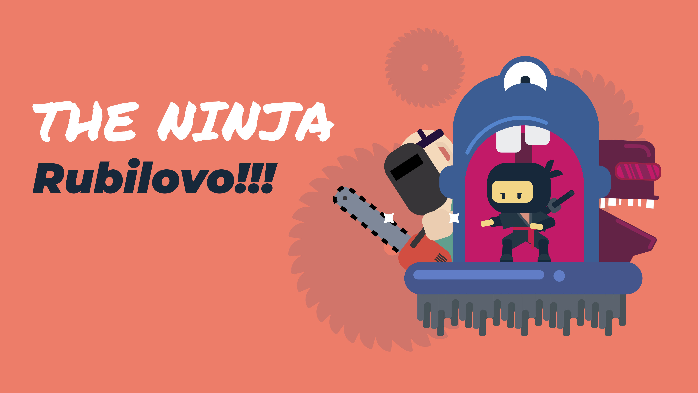
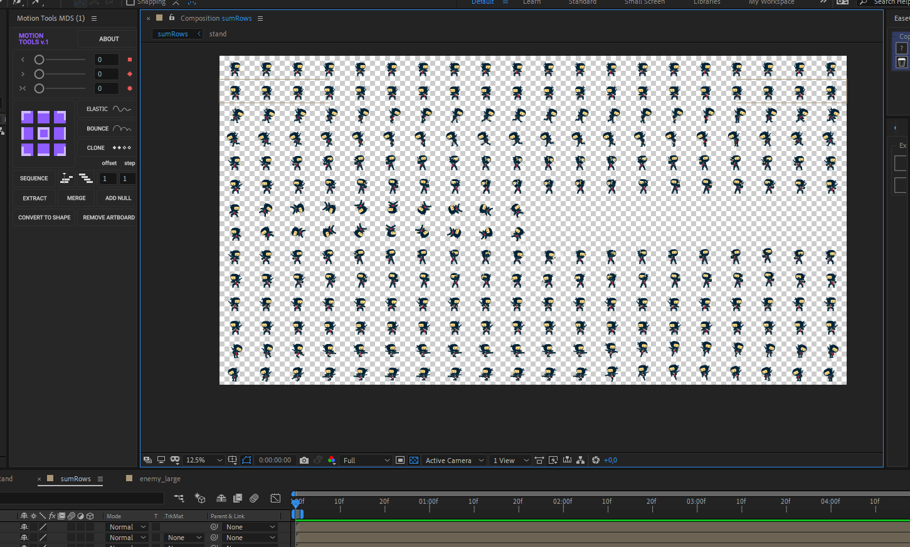
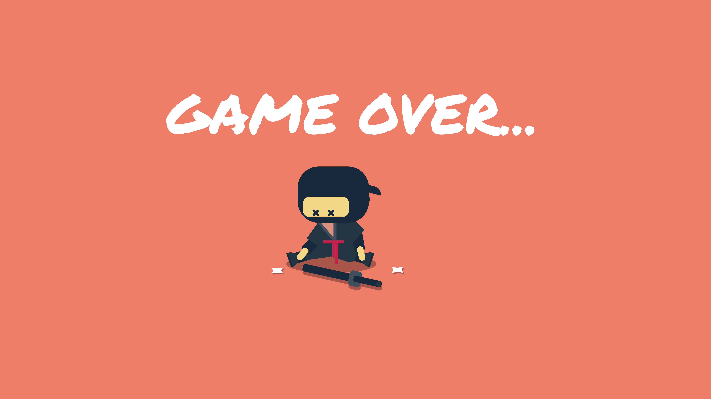

# :fist_oncoming: Welcome to "The Ninja. :crossed_swords: Rubilovo!!!"

This project has been created using **Adobe Illustrator, After Effects, HTML, CSS, JS, CANVAS**, you can try it: 
https://antonio63963.github.io/ninja-game/

---

## :cartwheeling: Controll:
  - Run to the left / right if you press the keys «←»and«→» - Jump when press on «space»
  - Kick«W»
  - Use the sword RMB/F
  - Shoot  away shuriken LMB

---

## :hammer_and_wrench: Pic:

:pray: This game is in process, 
I do it on fun with vanilla 
tech and fun bugs of course))

